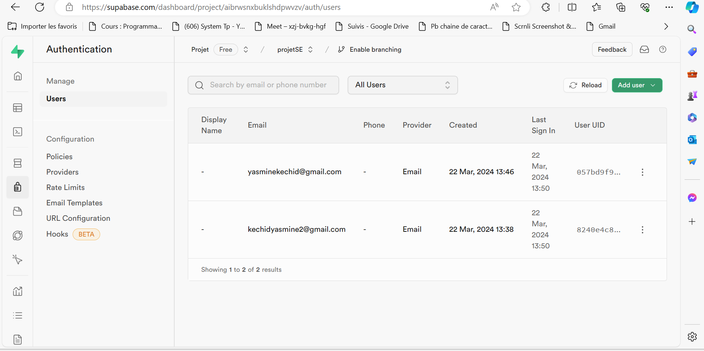

# Rapport sur l'implémentation des Sockets et l'Authentification Utilisateur

## Introduction
Ce rapport vise à documenter la mise en place des sockets pour la communication en temps réel dans une application, ainsi que les fonctionnalités d'authentification utilisateur utilisant Supabase.

## Sockets
### Étape 1 : Connexion au Serveur Socket.io
- Établissement d'une connexion avec le serveur Socket.io à l'aide de la bibliothèque `socket.io-client`.
- Gestion de la connexion dans un composant React à l'aide de `useEffect`.

### Étape 2 : Réception et Envoi de Messages
- Réception des messages du serveur à l'aide de l'événement `'message'`.

```javascript
socket.on('message', async (data) => { 
    console.log('Message received from client:', data);
})
```

- Envoi des messages au serveur à l'aide de la méthode `emit`.    

```javascript
socket.emit('message', {//vos attributs });
```

### Étape 3 : Enregistrement des Messages dans la Base de Données
- Utilisation d'une requête HTTP pour enregistrer les messages dans la base de données.
- Utilisation d'une condition pour n'enregistrer les messages que pour un chat spécifique.

## Authentification Utilisateur avec Supabase
### Création d'Utilisateur (`createUser`)
- Gestion de la création d'un nouvel utilisateur en utilisant l'API Supabase.
- Insertion des informations utilisateur dans la base de données après la création du compte.
- 
- Fonction :

```javascript
const { user, error } = await supabase.auth.signUp({
    email: email,
    password: password
});
```

### Connexion Utilisateur (`SignInUser`)
- Gestion de la connexion d'un utilisateur existant en utilisant l'adresse e-mail et le mot de passe.
- Retour des informations de session et de l'utilisateur connecté.
- Fonction :

```javascript
async function SignInUser(req, res) {
    const { email, password } = req.body;
    
    try {
        const { user, session, error } = await supabase.auth.signInWithPassword({
            email:email,
            password: password
        });
     
        if (error) {
            return res.status(400).json({ message: error.message });
        }
        const { data } = await supabase.auth.getSession();
    }
}
```

### Déconnexion Utilisateur (`signOut`)
- Gestion de la déconnexion de l'utilisateur actuellement connecté.
- Utilisation de la méthode `signOut` de Supabase pour terminer la session.
- Fonction :

```javascript
async function signOut(req, res) {
    try {
        const { error } = await supabase.auth.signOut();
    
        if (error) {
            return res.status(400).json({ message: error.message });
        }
       
        return res.status(200).json({ message: 'Successfully signed out' });
    } catch (error) {
        console.error('Error signing out user:', error.message);
        return res.status(500).json({ message: 'Internal server error' });
    }
}  
```

### Réinitialisation de Mot de Passe (`resetPassword`)
- Implémentation de la réinitialisation du mot de passe en cas d'oubli.
- Envoi d'un e-mail de réinitialisation et mise à jour du mot de passe dans la base de données.
- 
- Fonction :

```javascript
const { error1 } = await supabase.auth.resetPasswordForEmail("kechidyasmine2@gmail.com");
```

### Suppression de Compte Utilisateur (`DeleteUser`)
- Gestion de la suppression d'un compte utilisateur à partir de la base de données.
- Fonction :

```javascript
async function DeleteUser(req, res) {
    const { idu } = req.body;
    try {
        const { data, error } = await supabase
            .from('User')
            .delete()
            .eq("id", idu);
        if (error) throw error;
        res.json(data);
    } catch (error) {
        console.error('Error deleting user:', error);
        res.status(500).json({ error: 'Error deleting user' });
    }
}
```

### Récupération des Utilisateurs (`getUsers`)
- Récupération de la liste des utilisateurs enregistrés dans la base de données.
- Fonction :

```javascript
async function getUsers(req, res) {
    try {
        const { data, error } = await supabase
            .from('User')
            .select('*');
        if (error) throw error;
        res.json(data);
    } catch (error) {
        console.error('Error fetching users:', error);
        res.status(500).json({ error: 'Error fetching users' });
    }
}
```## Installation des dépendances Node.js

Pour installer les packages nécessaires dans votre application Node.js, exécutez la commande suivante :

```bash
npm install express supabase
```

## Installation de React

Pour installer React dans votre application, vous pouvez utiliser la commande suivante :

```bash
npx create-react-app nom_de_votre_app
```

## Relier les applications Node.js et React

Pour connecter votre application React à votre serveur Node.js, vous pouvez spécifier un proxy dans le fichier `package.json` de votre application React. Ajoutez la ligne suivante :

```json
"proxy": "http://localhost:5000"
```

Cela permettra à votre application React de faire des requêtes au serveur Node.js sans avoir à spécifier l'adresse complète.

## Lancement du serveur

Pour exécuter votre serveur Node.js, utilisez l'une des commandes suivantes, selon votre configuration :

```bash
npm start
```
ou
```bash
npm run dev
```

## Lancement de l'application client

Pour lancer votre application client React, exécutez la commande suivante :

```bash
npm start
```

Cela démarrera l'application React et l'ouvrira dans votre navigateur par défaut.


## Installation du socket côté client

Pour installer la bibliothèque socket.io dans votre application côté client, exécutez la commande suivante :

```bash
npm install socket.io-client
```

## Installation du socket côté serveur

Pour installer la bibliothèque socket.io dans votre application côté serveur, utilisez la commande suivante :

```bash
npm install socket.io
```


## Conclusion
Ce rapport a décrit  l'implémentation des sockets pour la communication en temps réel dans une application, ainsi que les fonctionnalités d'authentification utilisateur utilisant Supabase. Ces fonctionnalités sont essentielles pour assurer la sécurité et la convivialité de l'application.


